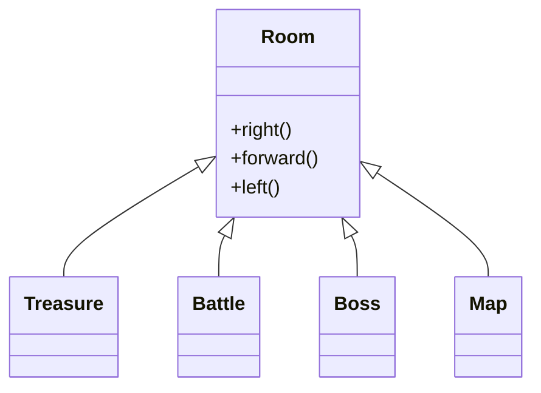
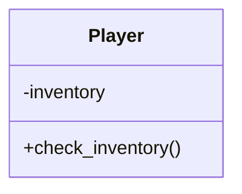
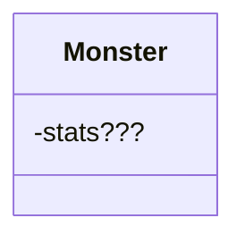

# 2025-summary-project

- This is a simple MUD game about exploring a dungeon hunting rascal (or mega knight) Data designer DO YOUR JOB NOW 😡😡😡😡😡😡

## About

[Drop Lore Here]

## Members

- Edward Yee (Team Lead)
- Lohith Ishan (Test Enginneer)
- Luke Yeo (Game Programmer)
- Matthew Na (Game Programmer)
- Matthew Sim (Data Designer)

## Project Structure

```
.
├── README.md
├── main.py (we might end up with a Game class too? --> this was from the template so see how)
├── mud.py
├── environment
├───── map.py (linkedlist using room's child classes)
├───── room.py
├───── treasure.py (inherit from room)
├───── battle.py (inherit from room)
├───── boss.py (inherit from room)
├── entities
├───── stats.py (name is subject to change, i added this because both monster and player have stats(id assume) --> inheritance, maybe polymorphic method actions() also?)
├───── monster.py (could become enemy if it goes to mega knight lore)
├───── player.py 
├── objects
├───── item.py
├───── inventory.py (potential hashtable, not necessary to overcomplicate though)
├── tests
├───── test1.py
├───── test2.py
├───── test3.py 
├───── ... (not too sure how many things Mr Tester will be needing)
├── data
├───── save.json
├───── items.json
├───── monsters.json 
├── helper
├───── extract_json.py
├───── pack_json.py 
```
(subjected to change)

## Classes 

VVVV We should prob class diagram that stuff gang VVVV

pls change when decided on whether stats should be a separate class or just internal attribute




## Gameplay

- Gameplay is mainly turn-based with events that occur upon reaching new stages within this MUD
- Options are given and can be chosen by typing in the corresponding number

```bash
For example:
Would you like to
1. Move Left
2. Move Right
3. Move Forward
Choose your option: <choice>
```

### Movement

- From the starting room, you are allowed to move to the left, forward, or right.
- You will be provided with which directions you are allowed to move in
- However, you will not be able to know which room that you will be moving into

### Combat

- Combat is a turn-based system where you are able to fight with monsters
- You are able to utilise weapons and weapons provide additional damage (maybe additional effects)
- You will also be able to use your inventory
- Using your inventory will not count toward ending your turn, and you can only use items when it is your turn

# Footnote

This is a J1 Summary Project. Names, characters, businesses, places, events and incidents are either the products of the author’s imagination or used in a fictitious manner. Any resemblance to actual persons, living or dead, or actual events is purely coincidental. Apologies to those who feel distress due to unintentional fate alignment.
