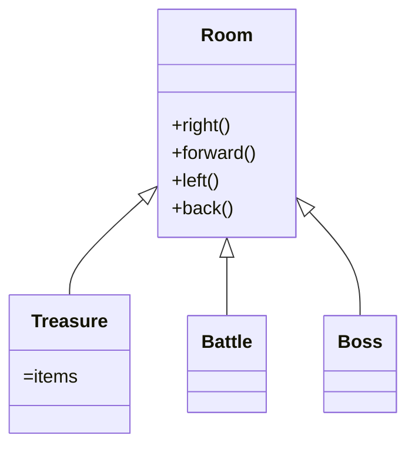
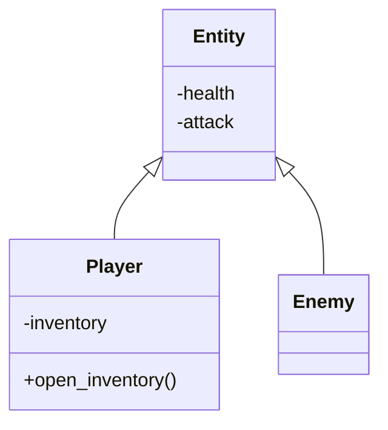

# 2025-summary-project
## The Rise of the Mega Knight 
- This is a simple MUD game about exploring a dungeon hunting rascal (or mega knight) 

## About
Before he was feared across the Arena for his crushing leaps and unstoppable weight, the Mega Knight was just a nameless soldier - strong, yes, but overlooked. His armor was dented, his sword dull, and his name never chanted in the stands like the Prince or the Musketeer. But he had a fire inside him — a will to prove that strength wasn’t just about weapons, but about endurance. Through his perseverance, he has come to face his last trial to become the strongest warrior in the kingdom… 

 #### Trial 3: The Leap of Faith 
 One day, after years in silence, the King summoned all the warriors in the kingdom to the colosseum, for one purpose, to crown the strongest warrior in the kingdom.
In this game, you will help him get through his final trial. Can Mega Knight win the tournament and acclaim the title of the greatest warrior in the kingdom?

## Members

- Edward Yee (Team Lead)
- Lohith Ishan (Test Enginneer)
- Luke Yeo (Game Programmer)
- Matthew Na (Game Programmer)
- Matthew Sim (Data Designer)

## Project Structure

```lua
.
├── README.md
├── main.py (we might end up with a Game class too? --> this was from the template so see how)
├── mud.py
├── environment
├───── map.py (linkedlist using room's child classes)
├───── room.py
├───── treasure.py (inherit from room)
├───── battle.py (inherit from room)
├───── boss.py (inherit from room)
├── entities
├───── stats.py (name is subject to change, i added this because both monster and player have stats(id assume) --> inheritance, maybe polymorphic method actions() also?)
├───── monster.py (could become enemy if it goes to mega knight lore)
├───── player.py 
├── objects
├───── item.py
├───── inventory.py (potential hashtable, not necessary to overcomplicate though)
├── tests
├───── test1.py
├───── test2.py
├───── test3.py 
├───── ... (not too sure how many things Mr Tester will be needing)
├── data
├───── save.json
├───── items.json
├───── monsters.json 
├── helper
├───── extract_json.py
├───── pack_json.py 
```
(subjected to change)

## Classes 

VVVV We should prob class diagram that stuff gang VVVV

pls change when decided on whether stats should be a separate class or just internal attribute




## Gameplay

- Gameplay is mainly turn-based with events that occur upon reaching new stages within this MUD
- Options are given and can be chosen by typing in the corresponding number

```bash
For example:
Would you like to
1. Move Left
2. Move Right
3. Move Forward
Choose your option: <choice>
```

### Movement

- From the starting room, you are allowed to move to the left, forward, or right.
- You will be provided with which directions you are allowed to move in
- However, you will not be able to know which room that you will be moving into

### Combat

- Combat is a turn-based system where you are able to fight with monsters
- You are able to utilise weapons and weapons provide additional damage (maybe additional effects)
- You will also be able to use your inventory
- Using your inventory will not count toward ending your turn, and you can only use items when it is your turn

# Footnote

This is a J1 Summary Project. Names, characters, businesses, places, events and incidents are either the products of the author’s imagination or used in a fictitious manner. Any resemblance to actual persons, living or dead, or actual events is purely coincidental. Apologies to those who feel distress due to unintentional fate alignment.
